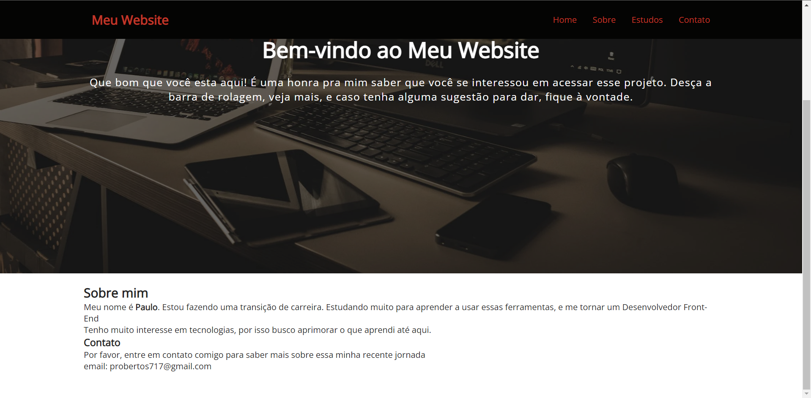

# Criada uma página para Internet

>Projeto desenvolvido com base em outro projeto disponivel no github

## Tecnologias

- HTML
- CSS
- JAVASCRIPT

## O que aprendi

- Fiz um uso maior do CSS, aprimorando e entendendo o seu uso
- Aprendi a formatar o texto no html, com o uso de tags

## Contato
- probertos717@gmail.com